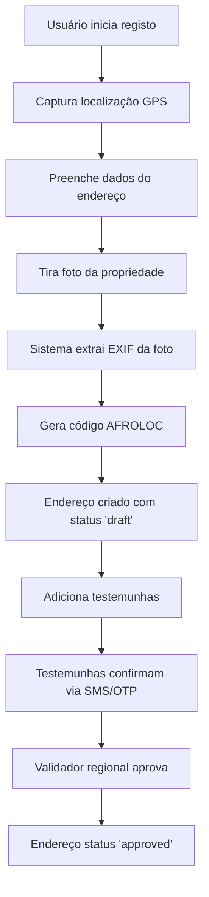

# AFROLOC - Documentação Completa da Aplicação

## 📋 Índice

1. [Visão Geral](#1-visão-geral)
2. [Tipos de Endereços](#2-tipos-de-endereços)
3. [Sistema de Usuários e Roles](#3-sistema-de-usuários-e-roles)
4. [Sistema de Níveis de Autorização](#4-sistema-de-níveis-de-autorização)
5. [Fluxo de Registo de Endereço](#5-fluxo-de-registo-de-endereço)
6. [Sistema de Testemunhas](#6-sistema-de-testemunhas)
7. [Score ATS (Address Trust Score)](#7-score-ats-address-trust-score)
8. [Ciclos de Verificação](#8-ciclos-de-verificação)
9. [Autenticação](#9-autenticação)
10. [Funcionalidades Offline](#10-funcionalidades-offline)
11. [Painel Administrativo](#11-painel-administrativo)
12. [Edge Functions (Backend)](#12-edge-functions-backend)
13. [Base de Dados](#13-base-de-dados)
14. [Internacionalização](#14-internacionalização)
15. [Segurança](#15-segurança)
16. [Integrações Externas](#16-integrações-externas)
17. [PWA e Mobile](#17-pwa-e-mobile)
18. [Rotas da Aplicação](#18-rotas-da-aplicação)

---

## 1. Visão Geral

### O que é o AFROLOC?

AFROLOC é uma plataforma digital de identificação e verificação de endereços físicos em África. O sistema atribui um código único (código AFROLOC) a cada endereço, permitindo:

- **Identificação única** de qualquer localização
- **Validação comunitária** através de testemunhas
- **Prevenção de fraudes** com múltiplas camadas de verificação
- **Inclusão digital** para endereços informais

### Objetivos Principais

1. Criar um sistema universal de endereçamento para África
2. Permitir validação descentralizada através da comunidade
3. Fornecer confiança digital para endereços físicos
4. Suportar funcionamento offline em áreas com conectividade limitada

### Stack Tecnológico

| Componente | Tecnologia |
|------------|------------|
| Frontend | React 18, TypeScript, Vite |
| Estilização | Tailwind CSS, shadcn/ui |
| Backend | Supabase (PostgreSQL + Edge Functions) |
| Autenticação | Supabase Auth (Email, Phone, Biometrics) |
| Mapas | Mapbox GL |
| Geoespacial | PostGIS |
| Mobile | Capacitor (Android/iOS) |
| PWA | Vite PWA Plugin |

---

## 2. Tipos de Endereços

O AFROLOC classifica endereços em três categorias:

### 2.1 Endereço Formal
- Possui rua, número e código postal oficial
- Exemplo: Rua das Flores, Nº 123, Luanda
- Ciclo de verificação: **365 dias**

### 2.2 Endereço Informal
- Possui rua e/ou número mas sem código postal oficial
- Exemplo: Bairro Boa Vista, Casa 45
- Ciclo de verificação: **180 dias**

### 2.3 Endereço Digital
- Apenas código AFROLOC e coordenadas GPS
- Para localizações sem nomenclatura oficial
- Ciclo de verificação: **90 dias**

### Formato do Código AFROLOC

```
[PAÍS].[NÍVEL1].[NÍVEL2].[NÍVEL3].[NÍVEL4].[RUA].[NÚMERO]
Exemplo: AO.LUA.ING.URB.25M.R001.0042
```

| Componente | Descrição |
|------------|-----------|
| AO | Código do país (Angola) |
| LUA | Província (Luanda) |
| ING | Município (Ingombota) |
| URB | Comuna/Bairro |
| 25M | Grid quadrante (25m) |
| R001 | Código da rua |
| 0042 | Número da propriedade |

---

## 3. Sistema de Usuários e Roles

### 3.1 Tipos de Usuários

| Role | Descrição | Permissões |
|------|-----------|------------|
| `citizen` | Usuário comum | Criar/gerir próprios endereços, adicionar testemunhas |
| `operator_field` | Operador de campo | Registar endereços para outros, modo offline |
| `validator_regional` | Validador regional | Validar endereços na sua região |
| `admin_commune` | Admin comunal (Nível 1) | Gerir comuna/bairro |
| `admin_municipal` | Admin municipal (Nível 2) | Gerir município |
| `admin_provincial` | Admin provincial (Nível 3) | Gerir província |
| `admin_national` | Admin nacional (Nível 4-5) | Gestão total do país |
| `auditor_read` | Auditor | Acesso apenas leitura |

### 3.2 Hierarquia Administrativa

```
Nível 5: Administrador Nacional (Super Admin)
    └── Nível 4: Administrador Provincial
            └── Nível 3: Administrador Municipal
                    └── Nível 2: Administrador Comunal
                            └── Nível 1: Administrador de Bairro
```

---

## 4. Sistema de Níveis de Autorização

Os usuários progridem através de 5 níveis baseados nas suas ações:

### Critérios de Progressão

| Nível | Nome | Endereços Verificados | Testemunhos | Taxa de Sucesso |
|-------|------|----------------------|-------------|-----------------|
| 1 | Iniciante | 0 | 0 | N/A |
| 2 | Básico | 1+ | 2+ | 50%+ |
| 3 | Intermédio | 3+ | 5+ | 70%+ |
| 4 | Avançado | 5+ | 10+ | 85%+ |
| 5 | Expert | 10+ | 20+ | 95%+ |

### Benefícios por Nível

- **Nível 1-2**: Operações básicas
- **Nível 3**: Pode ser testemunha de confiança
- **Nível 4**: Pode validar endereços regionalmente
- **Nível 5**: Acesso a funcionalidades avançadas

---

## 5. Fluxo de Registo de Endereço

### 5.1 Passo a Passo



### 5.2 Estados do Endereço

| Status | Descrição |
|--------|-----------|
| `draft` | Rascunho, aguardando testemunhas |
| `pending` | Aguardando validação |
| `active` | Ativo e verificado |
| `approved` | Aprovado por autoridade |
| `suspended` | Suspenso por irregularidade |
| `rejected` | Rejeitado |

---

## 6. Sistema de Testemunhas

### 6.1 Como Funciona

1. O proprietário do endereço adiciona testemunhas pelo código AFROLOC delas
2. Cada testemunha recebe um SMS com código OTP
3. A testemunha confirma respondendo SIM ou NÃO
4. O sistema regista a resposta e atualiza a reputação

### 6.2 Validação de Testemunhas

```
SMS enviado: "AFROLOC: Confirma endereço [CÓDIGO] localizado em [LAT, LON]? Responda SIM ou NÃO"
```

### 6.3 Reputação de Testemunhas

| Ação | Pontos |
|------|--------|
| Confirmar endereço válido | +5 |
| Rejeitar endereço fraudulento | +3 |
| Confirmar endereço fraudulento | -20 |
| Não responder | -2 |

### 6.4 Requisitos Mínimos

- Mínimo de **2 testemunhas** por endereço
- Testemunhas devem ter nível 2+ de autorização
- Testemunhas não podem ser parentes do proprietário

---

## 7. Score ATS (Address Trust Score)

### 7.1 Componentes do Score (0-100)

| Componente | Peso | Descrição |
|------------|------|-----------|
| GPS | 25 pts | Validação de coordenadas |
| Telecom | 25 pts | Triangulação de torres celulares |
| EXIF | 20 pts | Metadados da foto |
| Testemunhas | 15 pts | Confirmações de testemunhas |
| Auditoria | 15 pts | Documentos e vistorias |

### 7.2 Níveis de Certificação

| Nível | Score | Nome | Cor |
|-------|-------|------|-----|
| 0 | 0-19 | Não Verificado | Vermelho |
| 1 | 20-39 | Básico | Laranja |
| 2 | 40-59 | Verificado | Amarelo |
| 3 | 60-79 | Certificado | Verde Claro |
| 4 | 80-100 | Premium | Verde Escuro |

### 7.3 Flags de Validação

- **spoofingRisk**: Possível GPS falsificado
- **lowConfidence**: Dados insuficientes
- **missingData**: Campos obrigatórios em falta
- **inconsistentData**: Dados contraditórios

---

## 8. Ciclos de Verificação

### 8.1 Frequência por Tipo

| Tipo de Endereço | Ciclo |
|------------------|-------|
| Formal | 365 dias |
| Informal | 180 dias |
| Digital | 90 dias |

### 8.2 Alertas de Risco

| Dias Restantes | Nível de Risco |
|----------------|----------------|
| > 30 dias | Baixo (Verde) |
| 15-30 dias | Médio (Amarelo) |
| 7-14 dias | Alto (Laranja) |
| < 7 dias | Crítico (Vermelho) |

### 8.3 Re-verificação

Quando o ciclo expira:
1. Endereço muda para status "pending"
2. Proprietário é notificado
3. Deve adicionar novas testemunhas
4. Processo de validação reinicia

---

## 9. Autenticação

### 9.1 Métodos Suportados

| Método | Descrição |
|--------|-----------|
| Email + Password | Tradicional com confirmação |
| Phone + OTP | SMS com código de 6 dígitos |
| Biometria | Face ID / Touch ID / Fingerprint |

### 9.2 Fluxo de Signup (Telefone)

```
1. Usuário insere número de telefone
2. Sistema envia OTP via SMS (Twilio)
3. Usuário insere código OTP
4. Sistema valida e cria conta
5. Perfil criado automaticamente
```

### 9.3 Autenticação 2FA para Admins

- Código enviado por email ou SMS
- 10 códigos de backup gerados
- Obrigatório para admins nível 3+

---

## 10. Funcionalidades Offline

### 10.1 Modo Operador de Campo

Permite registar endereços sem internet:

1. Operador faz login enquanto online
2. Dados de referência são sincronizados localmente
3. Registos são salvos em IndexedDB
4. Quando online, sincroniza com servidor

### 10.2 Armazenamento Local

| Dados | Storage |
|-------|---------|
| Registos offline | IndexedDB |
| Cache de zonas urbanas | IndexedDB |
| Configurações | localStorage |
| Fotos | IndexedDB (base64) |

### 10.3 Quota de Operador

- Máximo de **50 registos offline** por operador
- Quota reinicia após sincronização
- Configurável por administrador

---

## 11. Painel Administrativo

### 11.1 Funcionalidades por Módulo

#### Gestão de Usuários
- `/admin/user-management` - Lista e edita usuários
- `/admin/role-approvals` - Aprova pedidos de role

#### Configuração Regional
- `/admin/import-divisions` - Importa divisões administrativas
- `/admin/regional-management` - Gere regiões
- `/admin/country-config` - Configurações por país

#### Telecom
- `/admin/telecom-operators` - Operadoras móveis
- `/admin/cell-towers` - Torres celulares
- `/admin/validation-numbers` - Números de validação

#### Segurança
- `/admin/fraud-flags` - Flags de fraude
- `/admin/security-audit` - Auditoria de segurança
- `/admin/risk-dashboard` - Dashboard de risco

#### Relatórios
- `/admin/reports` - Relatórios gerais
- `/kpis-export` - Exportação de KPIs
- `/certification-kpis` - KPIs de certificação

---

## 12. Edge Functions (Backend)

### 12.1 Autenticação

| Função | Descrição |
|--------|-----------|
| `auth` | Autenticação principal |
| `phone-login` | Login por telefone |
| `biometric-login` | Login biométrico |
| `send-signup-otp` | Enviar OTP de registo |
| `verify-signup-otp` | Validar OTP |
| `send-admin-2fa` | 2FA para admins |
| `verify-admin-2fa` | Validar 2FA |
| `generate-backup-codes` | Gerar códigos backup |
| `verify-backup-code` | Validar código backup |

### 12.2 Endereços

| Função | Descrição |
|--------|-----------|
| `address-create` | Criar endereço |
| `address-verify` | Verificar endereço |
| `address-gateway` | Gateway de API pública |
| `qg-engine` | Engine de códigos QG/SQ |
| `sq-engine` | Engine de códigos SQ |
| `resolve-zone` | Resolver zona urbana/rural |

### 12.3 Testemunhas

| Função | Descrição |
|--------|-----------|
| `send-witness-otp` | Enviar OTP a testemunha |
| `verify-witness-otp` | Validar OTP da testemunha |
| `receive-witness-sms` | Webhook Twilio para SMS |
| `notify-requester-validation` | Notificar resultado |

### 12.4 Score e Validação

| Função | Descrição |
|--------|-----------|
| `ats-engine` | Calcular ATS Score |
| `ats-score` | API de score |
| `telecom-fusion` | Fusão de dados telecom |
| `check-risk-alerts` | Verificar alertas |
| `send-risk-alert` | Enviar alertas |

### 12.5 Administração

| Função | Descrição |
|--------|-----------|
| `admin-users` | Gestão de usuários |
| `audit-log` | Log de auditoria |
| `import-cell-towers` | Importar torres |
| `import-urban-zones` | Importar zonas urbanas |
| `batch-assign-qgsq` | Atribuir QG/SQ em lote |
| `csv-export` | Exportar CSV |
| `seed-test-data` | Dados de teste |

### 12.6 Notificações

| Função | Descrição |
|--------|-----------|
| `send-push-notification` | Push notifications |
| `send-validation-reminder` | Lembretes de validação |
| `send-contact-email` | Emails de contacto |
| `send-fraud-alert-email` | Alertas de fraude |
| `send-weekly-analytics-report` | Relatório semanal |

---

## 13. Base de Dados

### 13.1 Tabelas Principais

#### `afroloc_records`
Registos de endereços AFROLOC.

| Coluna | Tipo | Descrição |
|--------|------|-----------|
| id | uuid | ID único |
| user_id | uuid | Proprietário |
| code | text | Código AFROLOC |
| country | text | Código do país |
| level1_name/code | text | Província |
| level2_name/code | text | Município |
| level3_name/code | text | Comuna |
| level4_name/code | text | Bairro |
| street_name/code | text | Rua |
| number | text | Número |
| geo_lat/geo_lon | numeric | Coordenadas GPS |
| address_type | text | formal/informal/digital |
| status | enum | draft/pending/active/approved/suspended/rejected |
| last_verified_at | timestamp | Última verificação |
| next_verification_due | timestamp | Próxima verificação |

#### `afroloc_witnesses`
Testemunhas de endereços.

| Coluna | Tipo | Descrição |
|--------|------|-----------|
| id | uuid | ID único |
| afroloc_record_id | uuid | FK para endereço |
| witness_user_id | uuid | ID da testemunha |
| witness_afro_id | text | Código AFROLOC da testemunha |
| status | text | pending/confirmed/rejected |
| otp_code | text | Código OTP |
| otp_sent_at | timestamp | Quando foi enviado |
| confirmed_at | timestamp | Quando confirmou |
| witness_reputation_score | numeric | Score de reputação |

#### `profiles`
Perfis de usuários.

| Coluna | Tipo | Descrição |
|--------|------|-----------|
| id | uuid | ID único |
| user_id | uuid | FK para auth.users |
| full_name | text | Nome completo |
| phone | text | Telefone |
| afro_id | text | Código AFROLOC pessoal |
| country | text | País |
| city | text | Cidade |
| two_factor_enabled | boolean | 2FA ativo |

#### `user_authorization_levels`
Níveis de autorização dos usuários.

| Coluna | Tipo | Descrição |
|--------|------|-----------|
| user_id | uuid | FK para auth.users |
| current_level | integer | Nível atual (1-5) |
| administrative_role | text | Role administrativa |
| jurisdiction_* | text | Jurisdição geográfica |

#### `user_roles`
Roles atribuídas aos usuários.

| Coluna | Tipo | Descrição |
|--------|------|-----------|
| user_id | uuid | FK para auth.users |
| role | enum | citizen/operator_field/validator_regional/admin_* |

### 13.2 Tabelas de Suporte

| Tabela | Descrição |
|--------|-----------|
| `countries` | Configurações por país |
| `administrative_divisions` | Divisões administrativas |
| `telecom_operators` | Operadoras de telecomunicações |
| `cell_towers` | Torres celulares |
| `urban_zones` | Zonas urbanas (PostGIS) |
| `validation_phone_numbers` | Números de validação regional |
| `documents` | Documentos do sistema |
| `identity_documents` | Documentos de identidade |

### 13.3 Tabelas de Segurança

| Tabela | Descrição |
|--------|-----------|
| `security_events` | Eventos de segurança |
| `security_audit_log` | Log de auditoria |
| `biometric_devices` | Dispositivos biométricos |
| `two_factor_codes` | Códigos 2FA |
| `two_factor_backup_codes` | Códigos de backup |
| `phone_otp_verifications` | Verificações OTP |
| `witness_fraud_flags` | Flags de fraude |

---

## 14. Internacionalização

### 14.1 Idiomas Suportados

| Código | Idioma | País/Região |
|--------|--------|-------------|
| pt | Português | Angola, Moçambique |
| en | English | Internacional |
| fr | Français | África Francófona |
| sw | Swahili | África Oriental |
| ar | العربية | Norte de África |
| am | አማርኛ | Etiópia |
| yo | Yorùbá | Nigéria |
| zu | isiZulu | África do Sul |
| sn | Shona | Zimbabwe |
| ln | Lingala | Congo |
| umb | Umbundu | Angola |
| kmb | Kimbundu | Angola |
| kg | Kikongo | Angola, Congo |

### 14.2 Estrutura de Traduções

```
src/translations/
├── pt.json     # Português (base)
├── en.json     # English
├── fr.json     # Français
├── sw.json     # Swahili
├── ar.json     # Arabic
├── am.json     # Amharic
├── yo.json     # Yoruba
├── zu.json     # Zulu
├── sn.json     # Shona
├── ln.json     # Lingala
├── umb.json    # Umbundu
├── kmb.json    # Kimbundu
└── kg.json     # Kikongo
```

### 14.3 Uso no Código

```typescript
import { useLanguage } from "@/contexts/LanguageContext";

function Component() {
  const { t, language, setLanguage } = useLanguage();
  
  return <h1>{t("welcome")}</h1>;
}
```

---

## 15. Segurança

### 15.1 Row Level Security (RLS)

Todas as tabelas têm políticas RLS ativas:

```sql
-- Exemplo: usuários só veem seus próprios registos
CREATE POLICY "Users can view own records" ON afroloc_records
  FOR SELECT USING (auth.uid() = user_id);
```

### 15.2 Validação de Inputs

- Todos os inputs validados com **Zod**
- Sanitização de dados no backend
- Rate limiting em Edge Functions

### 15.3 Detecção de Fraude

| Flag | Descrição |
|------|-----------|
| `gps_spoofing` | GPS falsificado |
| `multiple_phones` | Múltiplos telefones |
| `rapid_confirmations` | Confirmações muito rápidas |
| `suspicious_pattern` | Padrão suspeito |
| `colluding_witnesses` | Testemunhas em conluio |

### 15.4 Auditoria

- Todas as ações críticas são logadas
- Retenção de 90 dias
- Exportável para compliance

---

## 16. Integrações Externas

### 16.1 Twilio (SMS)

- Envio de OTPs
- Webhook para respostas
- Configuração por operadora

### 16.2 Mapbox

- Visualização de mapas
- Geocoding reverso
- Tokens geridos por Edge Function

### 16.3 Resend (Email)

- Notificações por email
- Alertas de fraude
- Relatórios semanais

---

## 17. PWA e Mobile

### 17.1 Progressive Web App

- Instalável em qualquer dispositivo
- Funciona offline
- Push notifications

### 17.2 Capacitor (Mobile Nativo)

Plugins utilizados:

| Plugin | Funcionalidade |
|--------|----------------|
| @capacitor/camera | Captura de fotos |
| @capacitor/geolocation | GPS |
| @capacitor/network | Status de rede |
| @capacitor/preferences | Storage local |
| capacitor-native-biometric | Biometria |

### 17.3 Plataformas

- **Android**: APK disponível
- **iOS**: Em desenvolvimento
- **Web**: PWA instalável

---

## 18. Rotas da Aplicação

### 18.1 Públicas

| Rota | Página |
|------|--------|
| `/landing` | Página inicial |
| `/pricing` | Preços |
| `/about` | Sobre |
| `/faq` | FAQ |
| `/contact` | Contacto |
| `/login` | Login |
| `/signup` | Registo |
| `/documents` | Documentos públicos |

### 18.2 Autenticadas (Usuário)

| Rota | Página |
|------|--------|
| `/dashboard` | Dashboard principal |
| `/identities` | Lista de identidades |
| `/my-addresses` | Meus endereços |
| `/create-identity` | Criar identidade |
| `/identity/:id` | Detalhe da identidade |
| `/identity/:id/edit` | Editar endereço |
| `/identity/:id/add-witness` | Adicionar testemunha |
| `/profile` | Perfil do usuário |
| `/user-levels` | Níveis de autorização |

### 18.3 Administrativas

| Rota | Página |
|------|--------|
| `/admin/login` | Login admin |
| `/admin/user-management` | Gestão de usuários |
| `/admin/role-approvals` | Aprovação de roles |
| `/admin/reports` | Relatórios |
| `/admin/risk-dashboard` | Dashboard de risco |
| `/admin/fraud-flags` | Flags de fraude |
| `/admin/security-audit` | Auditoria |
| `/admin/country-config` | Config. por país |
| `/admin/telecom-operators` | Operadoras |
| `/admin/cell-towers` | Torres celulares |
| `/admin/import-divisions` | Importar divisões |
| `/admin/import-urban-zones` | Importar zonas urbanas |

### 18.4 Validação

| Rota | Página |
|------|--------|
| `/regional-validation` | Validação regional |
| `/validations-dashboard` | Dashboard de validações |
| `/authority/gps-validation` | Validação GPS |
| `/confirm-witness/:id` | Confirmar testemunha |

### 18.5 Offline

| Rota | Página |
|------|--------|
| `/offline-create` | Criar offline |
| `/offline-sync` | Sincronizar |

---

## 📊 Métricas e KPIs

### KPIs Principais

1. **Taxa de Aprovação**: % de endereços aprovados
2. **Tempo Médio de Validação**: Dias entre criação e aprovação
3. **Cobertura Geográfica**: % de zonas com registos
4. **Reputação Média**: Score médio de testemunhas
5. **Taxa de Fraude**: % de flags de fraude

### Exportação

- CSV por província
- CSV de crescimento
- CSV de resumo
- CSV de time series

---

## 🔧 Manutenção

### Tarefas Agendadas

| Tarefa | Frequência |
|--------|------------|
| `cleanup-expired-otps` | Diária |
| `check-risk-alerts` | Diária |
| `send-validation-reminder` | Diária |
| `send-weekly-analytics-report` | Semanal |
| `recalculate-authorization-levels` | Semanal |

### Backup

- Backup automático da base de dados
- Retenção de 30 dias
- Restauração ponto-no-tempo

---

## 📞 Suporte

- **Email**: support@afroloc.com
- **Documentação**: Este documento
- **Logs**: Via painel administrativo

---

## 📄 Versão do Documento

| Versão | Data | Autor |
|--------|------|-------|
| 1.0 | 2024-12-25 | Sistema |

---

*© 2024 AFROLOC - Sistema de Identificação Digital de Endereços*
